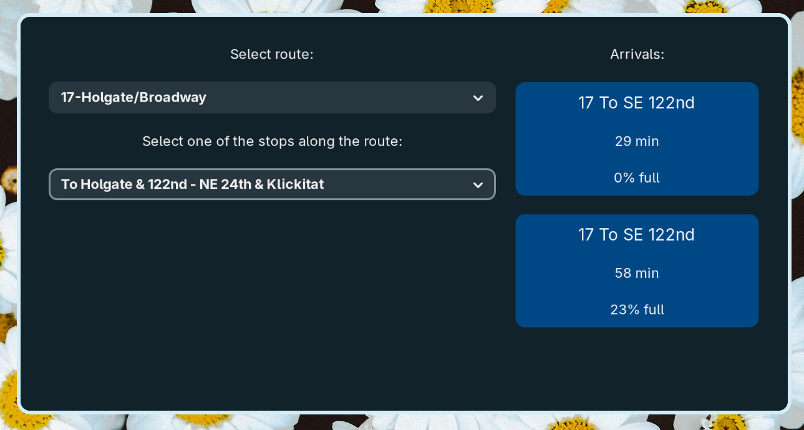

# TrimetVehicleTracker
An app for seeing the current schedule and location of all Trimet vehicles (buses, MAXs and street cars).


## To install:
Make sure you have PyGObject installed, then clone this repository.

To run the app:
```
cd TrimetVehicleTracker
python3 main.py
```